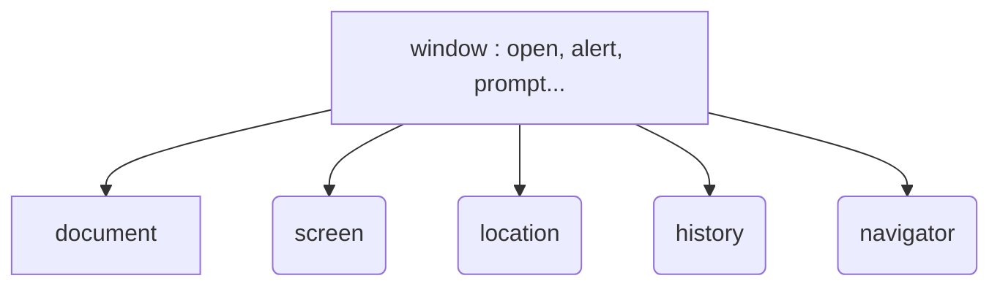
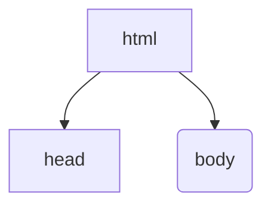

# 객체
## 종류
### 1) 내장 객체
- String, Date, Array, Math
```javascript
# 객체 생성
var tv = new Object();

tv.color = "white";
tv.price = 30000;
tv.info = function() {
    document.write("tv 색상 " + this.color,"<br>");
}
```
```javascript
# Date
var today = new Date();
var nowMonth = today.getMonth();
```
```javascript
# Array & String
# 이메일 유효성 검사

var userEmail = prompt("이메일주소?");
var arrUrl = [".co.kr","com",".net"];

var chk1 = false;
var chk2 = false;

if (userEmail.indexOf("@")>0) {
    chk1 = true;}

for (var i = 0 ; i<arrUrl.length;i++){
    if (userEmail.indexOf(arrUrl[i]) > 0 ){
        ch2 = true;}
}
```
### 2) 브라우저 객체 모델 _BOM_
- 브라우저에 계층 구조로 내장되어 있는 객체
- window, screen, location, history, navigator

```javascript
window.location.herf="URL"
```
### 3) 문서 객체 모델 _DOM_
- HTML 문서구조
- 



# 함수
## 선언 방법
### 1) 일반 함수 정의 -> hoisting (끌어올리다)

```javascript
var count = 0;
myFnc();

function myFnc(){
    count++;
    document.write("bye"+count,"<br>");
}

```
### 2) 익명 함수 -> hoisting X
```javascript
var count = 0;

var theFnc = function {
    count++;
    document.write("bye"+count,"<br>");
}

theFnc();
```

