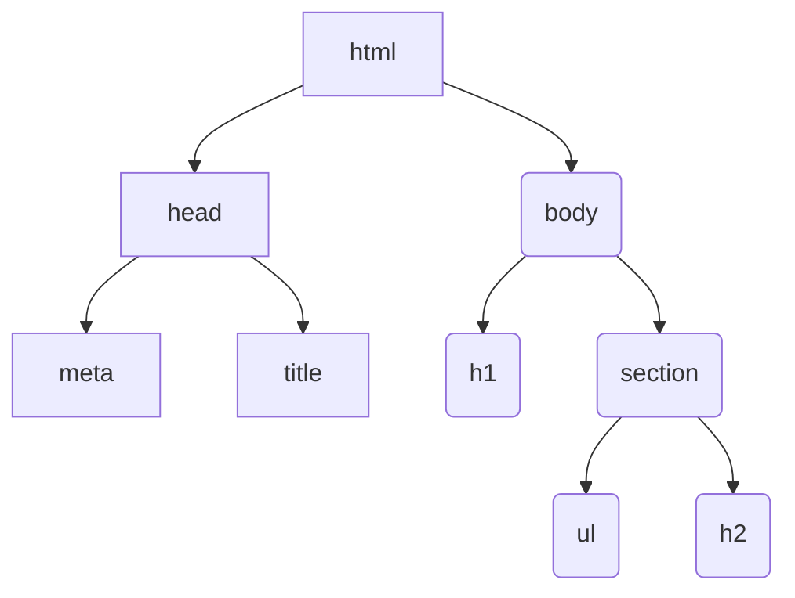

# 제이쿼리
모질라 존레식이 자바스크립트를 이용해 만든 라이브러리 언어
- 라이브러리 언어 : 자바스트립트로 만들어진 함수들의 집합
자바스크립트의 함수를 모아놓은 것..

## 기존 문제점 
### 1) DOM은 브라우저 간 호환성이 떨어짐
### 2) 못생긴 코드 + 멍청한 브라우저

암면라게뇨
# 제이쿼리 선택자
HTML 요소를 선택하여 가져옴

### 문서 객체 모델 _DOM_
HTML 문서 객체 구조

## 사용법
### 1) 문서 객체를 불러옴
### 2)

## jsp 태그
- label :
- input
  - name : data가 넘어갈 때 밀요한 요소
  - id : document에서 쉽게 찾기 위해서
  - class : 디자인 만들어짐 
- 